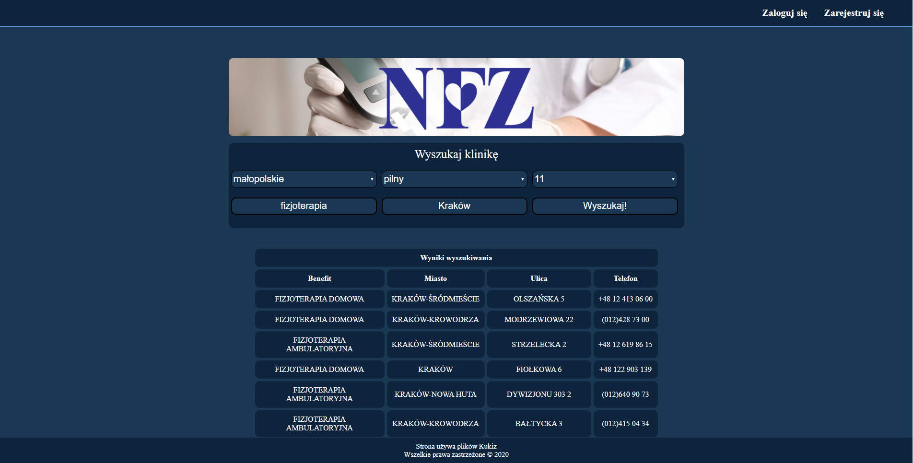

# FastMed App
## Spis Treści:
1. [Wstęp](#wstep)
2. [Funkcje aplikacji](#funkcjonalnosc)
    1. [Wyszukiwanie wizyt](#fast_search)
    2. [Logowanie oraz rejstracja do aplikacji](#login)
    3. [Ulubione](#fav)
    4. [Historia wyszukiwania](#history)
3. [Wykorzystane technologie](#stack)
4. [Autorzy](#authors)

 

# Wstęp
&nbsp;&nbsp;&nbsp;&nbsp;&nbsp;&nbsp;Nasza aplikacja o nazwie FastMed służy do wyszukiwania placówek, w których jest wolny termin do lekarza na podstawie krótkiego formularza. Po wyszukaniu otrzymujemy tabelę wraz z nazwą placówki, adresem oraz numerem kontaktowym.
 
&nbsp;&nbsp;&nbsp;&nbsp;&nbsp;&nbsp;Dodatkowe opcje aplikacji FastMed są dostępne po dokonaniu rejstracji lub zalogowaniu się na podstawie wcześniej stworzonego konta. Są nimi możliwość dodawania lub usuwania wybranych rekordów do bazy ulubionych i przeglądania listy ulibionych oraz swojej histroii wyszukiwania. W historii wyszukiwania ponadto możemy użyć "lupki" aby ponownie wyszukać interesującą nas wizytę.
 
&nbsp;&nbsp;&nbsp;&nbsp;&nbsp;&nbsp;Niestety z powodów technicznych nasza aplikacja hostowana jest na serwerze zewnętrznym. Można odnaleźć ją [TUTAJ](http://52.29.108.182:8081/).
 
 

<i>Ekran główny aplikacji FastMed</i>

 

# Funkcje Aplikacji

## Wyszukiwanie wizyt

<i>Ekran wyszukiwania aplikacji FastMed</i>

  
&nbsp;&nbsp;&nbsp;&nbsp;&nbsp;&nbsp;Wyszukiwanie wizyt jest dostępne zarówno przed jak i po zalogowaniu się użytkownika. Aby rozpocząć wyszukiwanie najpierw musimy wypełnić niewielki formularz. Obligatoryjnymi pozycjami do wyboru są: wojewódctwo, stan pacjenta (stabilny/pilny) oraz maksymalna ilość wyświetlanych rekordów. Dodatkowymi opcjami jest rodzaj możliwość wpisania nazwy miejscowości znajdującej się w danym wojewódctwie oraz rodzaj benefitu, przez który rozumiany jest typ szukanej placówki, przykładowo czy jest to poradnia, przychodnia lub fizjoterapia.  Obligatoryjnymi pozycjami do wyboru są: wojewódctwo, stan pacjenta (stabilny/pilny) oraz maksymalna ilość wyświetlanych rekordów. Dodatkowymi opcjami jest rodzaj możliwość wpisania nazwy miejscowości znajdującej się w danym wojewódctwie oraz rodzaj benefitu, przez który rozumiany jest typ szukanej placówki, przykładowo czy jest to poradnia, przychodnia lub fizjoterapia. Następnei po naciśnięciu przycisku "Wyszukaj" otrzymujemy tabelę wraz z nazwą placówki, adresem oraz numerem kontaktowym. Są to podstawowe informacje pozwalające nam na kontakt z daną placówką.  

 

## Logowanie oraz rejstracja do aplikacji

<i>Ekran logowania aplikacji FastMed</i>

 
&nbsp;&nbsp;&nbsp;&nbsp;&nbsp;&nbsp;Rejestracja konta oraz logowanie pozwala na używanie większej ilości funkcji w aplikacji FastMed. Funkcjami tymi jest mozliwość dodawania, usuwania oraz sprawdzania listy swoich ulubionych placówek oraz automatyczne zapisywanie wyszukiwanych przez nas wcześniej placówek.

 

## Ulubione

<i>Ekran ulubione aplikacji FastMed</i>

     
&nbsp;&nbsp;&nbsp;&nbsp;&nbsp;&nbsp;Dodawanie wybranych przez użytkownika placówek do zakładki "Ulubione" pozwala na szybsze poruszanie się po stronie. Gdy jednego dnia użytkownik będzie chciał wyszukać placówkę, jednak nie będzie miał czasu wykonać telefonu w celu umówienia wizyty, będzie mógł on dodać ją do wspomnianej zakładki i przykładowo następnego dnia szybko odnaleźć numer telefonu.

 

## Historia wyszukiwania

<i>Ekran histori aplikacji FastMed</i>

 
&nbsp;&nbsp;&nbsp;&nbsp;&nbsp;&nbsp;Aplikacja posiada funkcjonalność polegającą na automatycznym zapisywaniu historii wyszukiwania użytkownika. Funkcja ta jest bardzo przydatna, gdyż po wejściu w zakładkę "Historia" łatwo znaleźć załadowane wcześniej rekordy. Będzie to na pewno duża udogodność dla osób z chorobami przewlekłymi, u których choroby pojawiają się w większej częstotliwości.

 

## Wykorzystane technologie:
* python - język programowania wysokiego poziomu ogólnego przeznaczenia, o rozbudowanym pakiecie bibliotek standardowych, którego ideą przewodnią jest czytelność i klarowność kodu źródłowego. Jego składnia cechuje się przejrzystością i zwięzłością.

* HTTP cookie - mały fragment tekstu, który serwis internetowy wysyła do przeglądarki i który przeglądarka wysyła z powrotem przy następnych wejściach na witrynę. Używane jest głównie do utrzymywania sesji np. poprzez wygenerowanie i odesłanie tymczasowego identyfikatora po logowaniu. Może być jednak wykorzystywane szerzej poprzez zapamiętanie dowolnych danych, które można zakodować jako ciąg znaków. Dzięki temu użytkownik nie musi wpisywać tych samych informacji za każdym razem, gdy powróci na tę stronę lub przejdzie z jednej strony na inną.

* ajax - technika tworzenia aplikacji internetowych, w których interakcja użytkownika z serwerem odbywa się bez przeładowywania całego dokumentu, w sposób asynchroniczny. Ma to umożliwiać bardziej dynamiczną interakcję z użytkownikiem niż w tradycyjnym modelu, w którym każde żądanie nowych danych wiąże się z przesłaniem całej strony HTML.

* flask - mikro framework aplikacji webowych napisany w języku Python. Jest sklasyfikowany jako micro-framework, ponieważ nie wymaga określonych narzędzi ani bibliotek. Nie ma warstwy abstrakcji bazy danych, sprawdzania poprawności formularzy ani żadnych innych komponentów, w których istniejące biblioteki stron trzecich zapewniają wspólne funkcje. Jednak Flask obsługuje rozszerzenia, które mogą dodawać funkcje aplikacji tak, jakby były zaimplementowane w samym Flasku. Aby uniknąć restrykcji CORS origin użwane jest również rozszerzenie flask_cors.

* urlib - jest modułem Pythona do pobierania zasobów z sieci za pośrednictwem URL-i (ang. Uniform Resource Locators). Oferuje on uproszczony interfejs w formie funkcji urlopen, która pozwala na pobranie zasobów przy użyciu różnych protokołów.

* vue.js - Vue.js, podobnie jak React.js czy Angular, należy do rodziny najbardziej popularnych frameworków JavaScript służących do budowania interfejsów użytkownika. Pozwala na tworzenie zarówno prostych komponentów, jak i zaawansowanych i skalowalnych aplikacji typu SPA (Single-Page Application) przy wykorzystaniu dodatkowych narzędzi i bibliotek.

* API - baza API jest udostępniana nieodpłatnie poprzez Naradowy Fundusz Zdrowia i jest ona ogólnodostępna. Znaleźć ją można pod tym linkiem [NFZ](https://api.nfz.gov.pl/) w zakładce "Terminy Leczenia".
 

## Autorzy
* Konrad Flaka
* Tomasz Piechowicz
* Lech Kozyra
